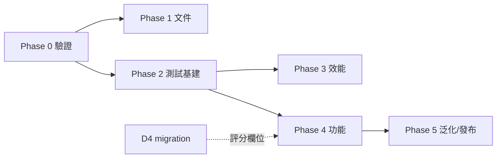

# 🗺 IRMS 架構與代碼計畫 (Roadmap)

> **相關文件**:[[HOME|導覽首頁]] · [[OPTIMIZATION|優化待辦(細項)]] · [[log_20260703_architecture_audit_fixes|審查修復日誌]]
> 本文件負責「決策與階段順序」;逐項細目仍以 [[OPTIMIZATION]] 為活清單。

---

## 一、架構決策 (Architecture Decisions)

### D1|判定引擎歸屬:App-Driven(採納)

**現況**:現行韌體無 Task_Logic/NVS/Profile 解析(只在舊版 `IRMS_Sensor_Full.bak` 存在),
達標/超限判定 100% 由 App 端 `TriggerEngine` 負責,硬體回饋由 App 下發 `CMD:` 直控 GPIO。

**決策:正式採 App-Driven 架構**,韌體職責收斂為「感測 + 濾波 + 傳輸 + CMD 執行」。

| 考量 | App-Driven(採納) | 韌體 Standalone(否決) |
|---|---|---|
| 判定邏輯單一來源 | ✅ TriggerEngine 一處 | ❌ 兩端各一份,曾發生控制權衝突 |
| 迭代速度 | ✅ 免燒錄 | ❌ 每次調規則都要燒錄 |
| 三種 triggerType 支援 | ✅ 已實作 | ❌ 舊韌體僅單一角度判定 |
| 離線可用性 | ❌ 需 App 在場 | ✅ 可獨立訓練 |

**後果**:
- OPTIMIZATION P0「下發 Profile 參數至韌體」→ **關閉,不需要**(判定不在韌體)。
- 離線 Standalone 模式若未來有臨床需求,列 Phase 5 選配,屆時以 NVS + Profile RX 重新設計,
  並以 `deviceConnected` 互斥避免雙引擎衝突(舊 Full.bak 可為參考)。
- `buildProfilePayload` / `buildSyncCommand` 維持 `@deprecated`。

### D2|文件以程式為準

README §3/§4 描述的 Task_Logic、NVS、10Hz 推播與現況不符。**以現行程式行為修正文件**
(實際:無 Task_Logic/NVS、Task_Comm 40ms≈25Hz、判定在 App)。文件—程式再分歧時,程式為準。

### D3|多關節泛化:資料模型先行

elbow/shoulder 沿用 thigh/shin 命名與軸向。泛化時**先改共享型別**
(`proximal/distal` 取代 `thigh/shin`),DB 欄位透過 migration 改名,UI 標籤由 protocol 對映,
最後才動判定邏輯。避免 UI 先行造成名實不符。

### D4|DB Schema 版本化

引入 `PRAGMA user_version` 遞增式 migration(目前 CREATE IF NOT EXISTS 無法演進 schema)。
Phase 2 建立機制,Phase 4 的評分欄位(`sessions.qualityScore`)是第一個消費者。

---

## 二、分階段計畫 (Phased Plan)

> 🖥 = 無需硬體即可完成 · 📡 = 需 ESP32 實機

### Phase 0|驗證與安全收尾(本週,P0)
- [→] 📡 燒錄韌體 + 實機 E2E → **已移至 GitHub issues [#2](https://github.com/yuhina0515/IRMS/issues/2) / [#3](https://github.com/yuhina0515/IRMS/issues/3)**(硬體阻塞項不再佔用桌面 backlog)
- [x] 🖥 **ERR 時主動關回饋**:收到 `ERR:` 即下發 `LED_OFF`+`ALARM_OFF`,防蜂鳴器卡死(2026-07-03)
- [x] 🖥 **斷線 Session 收尾**:重連耗盡或手動斷線時自動 End Session 並 flush 緩衝(2026-07-03)

### Phase 1|文件對齊(半天,D2 落地)
- [x] 🖥 README §3/§4、根 README 架構圖改為 App-Driven 現況(2026-07-04,隨韌體 v3 重寫一併完成)
- [x] 🖥 OPTIMIZATION 關閉「下發 Profile」項並註記 D1 決策;勾掉 2026-07-03 已修復項(2026-07-03)

### Phase 2|測試與品質基建(1–2 天)
- [x] 🖥 導入 **Vitest**:`triggerEngine`(狀態機邊界:進出區間/維持/休息/超限)、
      `parseAnglePacket`(6軸/舊格式/ERR/malformed)、`applyCalibration`、`reconcileSelection`
      (2026-07-03,22 tests;`npm run ci` = typecheck+test+build)
- [ ] 🖥 ESLint + Prettier;`npm run ci` = lint + typecheck + test + build(2026-08-01 會議明確延後)
- [x] 🖥 React ErrorBoundary 包各 view,防單點白屏(2026-08-01)
- [x] 🖥 DB migration 機制(`user_version`,見 D4)(2026-08-01,含 v1.0.1 升級路徑測試)

### Phase 3|效能(1 天)
- [ ] 🖥 LiveChart:rAF 聚合封包 + 節流至 ~20fps(25Hz 推播下必要)
- [x] 🖥 History 大 Session:LTTB 抽樣(2026-08-01,主進程抽樣至 1200 點,保留峰值)

### Phase 4|功能補完(按價值排序)
- [x] 🖥 **回補 v1 遺失功能「記憶姿勢 (Record Pose)」**:動作編輯 Modal 內即時顯示目前角度,
      一鍵擷取為 targetAngle(2026-08-01)
- [ ] 🖥 復健評分模型:平穩度(角速度變異)+ 達標維持率 → `sessions.qualityScore`(走 migration)
- [ ] 🖥 圖表 Roll 曲線切換、側欄收合持久化、重連視覺提示
- [ ] 🖥 i18n(繁中/EN)、淺色主題、快捷鍵(P2 全項見 [[OPTIMIZATION]])

### Phase 5|泛化與發布
- [ ] 🖥 多關節泛化(依 D3 順序:型別 → migration → UI → 判定)
- [ ] 🖥 electron-builder:圖示、metadata、簽章;electron-updater
- [ ] 📡(選配)韌體 Standalone 離線模式(依 D1 後果條款)

---

## 三、依賴關係

Phase 0 的兩個 🖥 項與 Phase 1、2 **不依賴硬體**,裝置未回歸前即可推進;
📡 驗證是 Phase 3 之後所有行為變更的信心基礎,裝置一到手優先做。

---

## 四、2026-08-01 全面檢視後的順位覆寫

[[log_20260801_meeting_app_review|多代理會議]]裁決的執行順序取代上方 Phase 的自然順序:

1. **判定正確性批次** — ✅ 完成(2026-08-01):rest 不變式、wrap-safe 角度數學、
   警報三修、參數鉗制、統一 reset、ErrorOverlay 逃生出口
2. **📡 桌面燒錄 + 實機 E2E** — 移至 GitHub issues
   [#2](https://github.com/yuhina0515/IRMS/issues/2)(燒錄 + ±180° 旋轉記錄)與
   [#3](https://github.com/yuhina0515/IRMS/issues/3)(完整 E2E)。硬體阻塞項一律走 issue,
   不再列在這份文件裡卡住桌面 backlog
3. **migration runner + session 收尾 + ErrorBoundary** — ✅ 完成(2026-08-01)

**新增專案規則**:動任何 UI 或校準工作之前,先指出它餵給哪一條判定路徑的輸入;
指不出來就是裝飾性的,排到清單最後面。

**校準快照 migration**:移至 [#4](https://github.com/yuhina0515/IRMS/issues/4)——
schema 形狀需先看過真實感測資料才能定案,故與 #2 綁定。

> **慣例**:需要實機/硬體的工作一律開 GitHub issue,不寫進 ROADMAP。
> 文件只追蹤「坐在桌前就能推進」的項目,避免硬體滑期時整份 backlog 看起來是空的。
