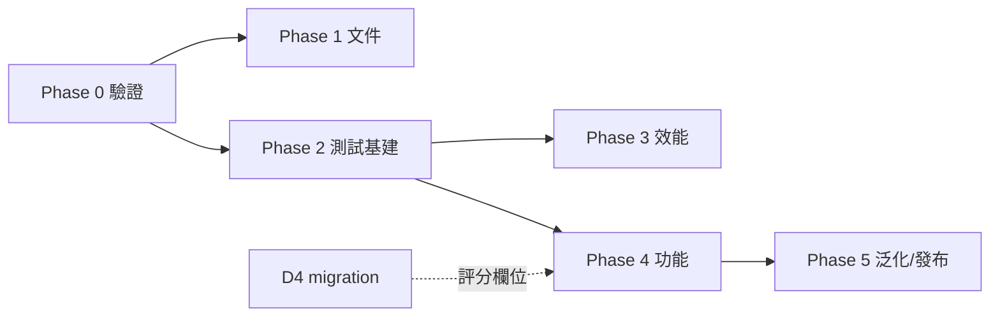

# 🗺 IRMS 架構與代碼計畫 (Roadmap)

> **相關文件**:[[HOME|導覽首頁]] · [[OPTIMIZATION|優化待辦(細項)]] · [[log_20260703_architecture_audit_fixes|審查修復日誌]]
> 本文件負責「決策與階段順序」;逐項細目仍以 [[OPTIMIZATION]] 為活清單。

---

## 一、架構決策 (Architecture Decisions)

### D1|判定引擎歸屬:App-Driven(採納)

**現況**:現行韌體無 Task_Logic/NVS/Profile 解析(只在舊版 `IRMS_Sensor_Full.bak` 存在),
達標/超限判定 100% 由 App 端 `TriggerEngine` 負責,硬體回饋由 App 下發 `CMD:` 直控 GPIO。

**決策:正式採 App-Driven 架構**,韌體職責收斂為「感測 + 濾波 + 傳輸 + CMD 執行」。

| 考量 | App-Driven(採納) | 韌體 Standalone(否決) |
|---|---|---|
| 判定邏輯單一來源 | ✅ TriggerEngine 一處 | ❌ 兩端各一份,曾發生控制權衝突 |
| 迭代速度 | ✅ 免燒錄 | ❌ 每次調規則都要燒錄 |
| 三種 triggerType 支援 | ✅ 已實作 | ❌ 舊韌體僅單一角度判定 |
| 離線可用性 | ❌ 需 App 在場 | ✅ 可獨立訓練 |

**後果**:
- OPTIMIZATION P0「下發 Profile 參數至韌體」→ **關閉,不需要**(判定不在韌體)。
- 離線 Standalone 模式若未來有臨床需求,列 Phase 5 選配,屆時以 NVS + Profile RX 重新設計,
  並以 `deviceConnected` 互斥避免雙引擎衝突(舊 Full.bak 可為參考)。
- `buildProfilePayload` / `buildSyncCommand` 維持 `@deprecated`。

### D2|文件以程式為準

README §3/§4 描述的 Task_Logic、NVS、10Hz 推播與現況不符。**以現行程式行為修正文件**
(實際:無 Task_Logic/NVS、Task_Comm 40ms≈25Hz、判定在 App)。文件—程式再分歧時,程式為準。

### D3|多關節泛化:資料模型先行

elbow/shoulder 沿用 thigh/shin 命名與軸向。泛化時**先改共享型別**
(`proximal/distal` 取代 `thigh/shin`),DB 欄位透過 migration 改名,UI 標籤由 protocol 對映,
最後才動判定邏輯。避免 UI 先行造成名實不符。

### D4|DB Schema 版本化

引入 `PRAGMA user_version` 遞增式 migration(目前 CREATE IF NOT EXISTS 無法演進 schema)。
Phase 2 建立機制,Phase 4 的評分欄位(`sessions.qualityScore`)是第一個消費者。

---

## 二、分階段計畫 (Phased Plan)

> 🖥 = 無需硬體即可完成 · 📡 = 需 ESP32 實機

### Phase 0|驗證與安全收尾(本週,P0)
- [→] 📡 燒錄韌體 + 實機 E2E → **已移至 GitHub issues [#2](https://github.com/yuhina0515/IRMS/issues/2) / [#3](https://github.com/yuhina0515/IRMS/issues/3)**(硬體阻塞項不再佔用桌面 backlog)
- [x] 🖥 **ERR 時主動關回饋**:收到 `ERR:` 即下發 `LED_OFF`+`ALARM_OFF`,防蜂鳴器卡死(2026-07-03)
- [x] 🖥 **斷線 Session 收尾**:重連耗盡或手動斷線時自動 End Session 並 flush 緩衝(2026-07-03)

### Phase 1|文件對齊(半天,D2 落地)
- [x] 🖥 README §3/§4、根 README 架構圖改為 App-Driven 現況(2026-07-04,隨韌體 v3 重寫一併完成)
- [x] 🖥 OPTIMIZATION 關閉「下發 Profile」項並註記 D1 決策;勾掉 2026-07-03 已修復項(2026-07-03)

### Phase 2|測試與品質基建(1–2 天)
- [x] 🖥 導入 **Vitest**:`triggerEngine`(狀態機邊界:進出區間/維持/休息/超限)、
      `parseAnglePacket`(6軸/舊格式/ERR/malformed)、`applyCalibration`、`reconcileSelection`
      (2026-07-03,22 tests;`npm run ci` = typecheck+test+build)。
      此後逐批擴充,**2026-08-12 現況為 144 tests / 14 files**
- [ ] 🖥 ESLint + Prettier;`npm run ci` = lint + typecheck + test + build(2026-08-01 會議明確延後)
- [ ] 🖥 **判定路徑的元件測試**(2026-08-03 裁定順位,只鎖臨床輸出面)。
      2026-08-07 的快速歸零缺陷正是死在這個缺口:純函式層全綠,但把值寫進 settings 的
      那個元件沒有任何覆蓋
- [x] 🖥 React ErrorBoundary 包各 view,防單點白屏(2026-08-01)
- [x] 🖥 DB migration 機制(`user_version`,見 D4)(2026-08-01,含 v1.0.1 升級路徑測試)

### Phase 3|效能(1 天)— ✅ 完成
- [x] 🖥 LiveChart 節流:以 `UI_SYNC_MS = 80` 尾緣節流同步 UI(2026-07-11)。
      **2026-08-03 會議裁定原本寫的「rAF 聚合封包」應自 backlog 刪除**——需求已被此實作
      滿足,rAF 只是同一件事的另一種寫法,留著會誤導成尚未處理
- [x] 🖥 History 大 Session:LTTB 抽樣(2026-08-01,主進程抽樣至 1200 點,保留峰值)

### Phase 4|功能補完(按價值排序)
- [x] 🖥 **回補 v1 遺失功能「記憶姿勢 (Record Pose)」**:動作編輯 Modal 內即時顯示目前角度,
      一鍵擷取為 targetAngle(2026-08-01)
- [~] 🖥 ~~復健評分模型 → `sessions.qualityScore`~~:**2026-08-03 會議否決**。BLE 協定沒有
      陀螺通道(只傳融合後角度)、封包量化底線 0.1°,以差分角度反推的「平穩度」量到的
      主要是量化雜訊。要做必須先擴充協定,屆時重開決策
- [ ] 🖥 圖表 Roll 曲線切換、側欄收合持久化、重連視覺提示
- [ ] 🖥 i18n(繁中/EN)、淺色主題、快捷鍵(P2 全項見 [[OPTIMIZATION]])

### Phase 5|泛化與發布
- [ ] 🖥 多關節泛化(依 D3 順序:型別 → migration → UI → 判定)
- [ ] 🖥 electron-builder:圖示、metadata、簽章;electron-updater
- [ ] 📡(選配)韌體 Standalone 離線模式(依 D1 後果條款)

---

## 三、依賴關係

Phase 0 的兩個 🖥 項與 Phase 1、2 **不依賴硬體**,裝置未回歸前即可推進;
📡 驗證是 Phase 3 之後所有行為變更的信心基礎,裝置一到手優先做。

---

## 四、2026-08-01 全面檢視後的順位覆寫

[[log_20260801_meeting_app_review|多代理會議]]裁決的執行順序取代上方 Phase 的自然順序:

1. **判定正確性批次** — ✅ 完成(2026-08-01):rest 不變式、wrap-safe 角度數學、
   警報三修、參數鉗制、統一 reset、ErrorOverlay 逃生出口
2. **📡 桌面燒錄 + 實機 E2E** — 移至 GitHub issues
   [#2](https://github.com/yuhina0515/IRMS/issues/2)(燒錄 + ±180° 旋轉記錄)與
   [#3](https://github.com/yuhina0515/IRMS/issues/3)(完整 E2E)。硬體阻塞項一律走 issue,
   不再列在這份文件裡卡住桌面 backlog
3. **migration runner + session 收尾 + ErrorBoundary** — ✅ 完成(2026-08-01)

**校準快照 migration**:移至 [#4](https://github.com/yuhina0515/IRMS/issues/4)——
schema 形狀需先看過真實感測資料才能定案,故與 #2 綁定。

> **慣例**:需要實機/硬體的工作一律開 GitHub issue,不寫進 ROADMAP。
> 文件只追蹤「坐在桌前就能推進」的項目,避免硬體滑期時整份 backlog 看起來是空的。

---

## 五、2026-08-03 目視驗收後的順位覆寫

[[log_20260803_meeting_direction_after_visual_pass|方向裁決會議]]的裁定順序:

1. **合併 PR #1** — ✅ 完成。最重大發現:`main` 一直在出貨會捏造 reps 的版本,而 v1.0.1
   正是從它切出來的;修正早已寫好卻躺在未合併分支上兩天
2. **修精靈第 5 步誤觸發** — ✅ 完成(commit `76d7011`)
3. 單一 `ingest(text)` 注入管線 → 元件測試(只鎖臨床輸出面)→ 感測器模型測試 →
   migration 6 原始欄位 → 對比修正 — ⏳ 未動工

**否決**:`FILTER_ALPHA` 0.85→0.98(模型缺陀螺零偏項,最佳解必然貼邊界;且提交它會
摧毀自己的驗證條件)、`qualityScore`、LiveChart rAF。

**規則變更**:「指出它餵給哪條判定路徑」→「**指出它改變哪一個決定,以及那是誰的
決定——引擎的,還是人的**」。舊規則按字面會把 History 畫錯的安全線判為裝飾性:
它不餵給引擎,卻改變督導的判讀。

---

## 六、2026-08-07 校正 bug 與響應式修正

[[log_20260807_meeting_calibration_bug_and_responsive_layout|會議紀錄]]。全數已落地並
於 2026-08-12 進版控:

1. **快速歸零漏套 `axisSwap`** — ✅ 抽成 `buildQuickZeroPatch` 純函式,vitest 覆蓋
2. **UI 5 項響應式修正** — ✅ 完成,**否決**「重新設計排版」的架構級重寫,依第 2 條
   專案規則(修缺陷、不擴大議程)只修具體缺陷
3. `env(titlebar-area-*)` 於真實 Electron 視窗實測生效(量到 136px)

**未緩解的已知限制**:`minHeight` 原值 680 是否真的超出 1366×768@125% 筆電的可用工作區,
三方都只做算術推導,未在該機型或對應 VM 上實測。修正本身無害(下修 + 夾在工作區內),
但其急迫性的前提未經驗證。

**⚠ 重要修正(2026-08-12 發現)**:這次會議的前提「使用者今日重新燒錄韌體並實機連線後提出
五點」意味著**韌體 v3 已燒錄、BLE 實機連線已成功、校準已在真裝置上跑過**。issues #2/#3 與
本文件先前的「硬體從未驗證」敘述據此已過時,已於 2026-08-12 更正。仍未驗證的是**回饋與
警報鏈**(達標音 → 超限長鳴 → 斷線收尾)——也就是引擎唯一會主動對患者發指令的部分。
