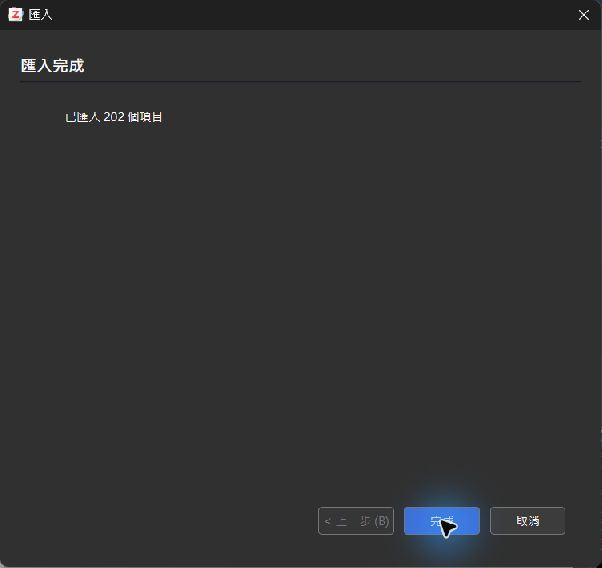

# Zotero 實際匯入驗收紀錄

日期：2026-10-06。來源提交：`b2ebbaf7402294956202c0d6e7ef07857c516cb0`。本次完成兩種書目格式的真實匯入及保存欄位核對；回匯出、瀏覽器與鍵盤驗收仍待完成。

## 環境與操作

使用者明確授權「允許官方免安裝版驗收」。由 [Zotero 官方下載頁](https://www.zotero.org/download/) 取得 Windows x64 ZIP，解壓後確認版本 **10.0.5**、執行檔 Authenticode 簽章 **Valid / Corporation for Digital Scholarship**；未執行安裝程式。

依 [官方 profile 說明](https://www.zotero.org/support/kb/multiple_profiles) 分別建立 `zotero-profile-bib`、`zotero-profile-ris`，並在啟動前指定不同的 `extensions.zotero.useDataDir`／`dataDir`。兩個空白資料庫皆在 `C:\Users\Yuhina\AppData\Local\Temp\irms-evidence-20261006` 內，沒有登入帳號或啟動同步。透過真正的 Windows File → Import 精靈選擇本庫輸出檔，兩次均顯示「已匯入 202 個項目」。

## 保存結果

關閉測試實例後，以 SQLite 唯讀模式比較實際匯入資料與 `catalog.json`，不是以自製解析器模擬 Zotero 匯入。BibTeX 實例因匯出對話框控制失敗而停止測試程序，RIS 實例以 Alt+F4 關閉；兩份資料庫均通過完整性檢查。

| 檢查 | BibTeX | RIS |
|---|---:|---:|
| 精靈完成筆數／保存條目 | 202／202 | 202／202 |
| 對應來源 URL | 202 | 202 |
| DOI 條目，與來源逐筆相符 | 157 | 157 |
| 期刊來源的卷期、期刊、頁碼／文章編號、年份 | 相符 | 相符 |
| 作者數、順序、姓／名及團體作者單欄模式 | 相符 | 相符 |
| SQLite `integrity_check` | ok | ok |

抽查包含 ICC 指引的 **Koo／Li 兩位作者**、PMID-32545227 的 DOI **10.3390/s20113322**／2020 年／4 位作者，以及 Léonie、Frédérique、Bielmann、Jean-Sébastien 等 UTF-8 名稱與來源中的團體作者。這是匯入保存核對，尚未證明回匯出能完整保留這些字元。

保留兩種可解釋差異：BibTeX 將 PMID-15844264、11934426、15311818 標題的 `--` 轉為 `–`；Madgwick 技術報告的來源描述 `Author technical report` 沒有存入期刊欄位，兩種格式都保留 report 類型。未因此改動原始書目或宣稱逐字回匯出相同。

ZIP、執行檔、輸入書目、保存資料庫、查核腳本與報告 SHA-256，以及代表性實際欄位見 [機器可讀驗收證據](data/zotero-acceptance.json)。原始唯讀查核腳本 `audit_zotero.py` 與兩份完整報告留在上述暫存目錄；暫存檔不是永久封存。

## 尚未完成

- **回匯出與往返核對**：匯出對話框可觀察，但工具對附屬視窗的操作失敗，曾回報 `element 152 is not available in cached app state` 及輸入點不屬於指定視窗；重新取得視窗後仍無法可靠選格式／儲存檔名。沒有已驗證的匯出檔，不能將此項列為通過。可在這兩個測試 profile 手動匯出，再比對 UTF-8 與作者。
- **瀏覽器 B01–B09**：Chrome 中只有 Zotero 歡迎頁；工具直接開啟知識庫 `file://` 時遭瀏覽器安全政策拒絕。未採替代協定、其他瀏覽器或其他途徑繞過拒絕，已請使用者手動依 [驗收清單](ACCEPTANCE_CHECKLIST.md) 回報。
- **V01／V02**：本次沒有新的裝置量測，仍須 [獨立角度參考及完整重戴／操作者／跨日資料](BENCH_PROTOCOL.md)。

第 4 項整體仍未完成；PR 合併保留在完整驗收之後。[全部後續工作](GOAL_PROGRESS.md) · [完整驗證紀錄](VERIFICATION.md)
